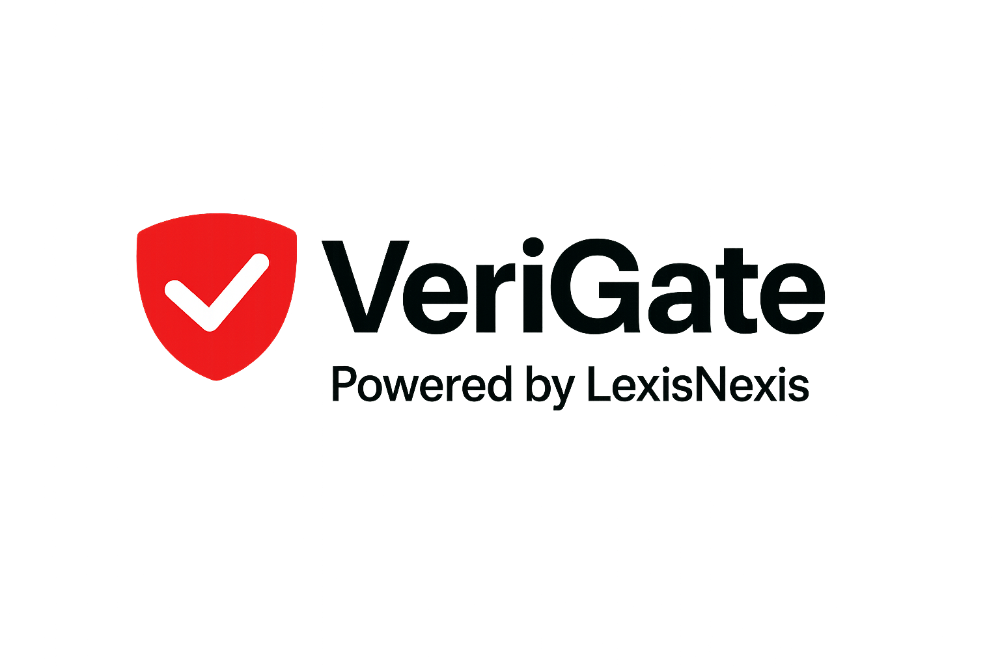
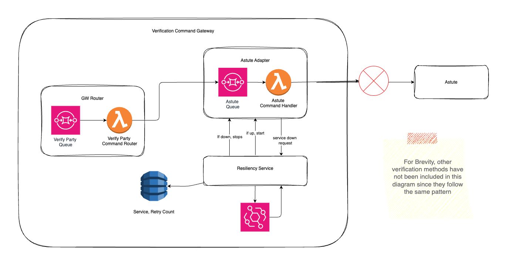

# Verigate Verification Platform

## Overview
**VeriGate** is a modular, pluggable risk verification gateway designed for public sector and enterprise environments. It enables organizations to seamlessly integrate real-time due diligence and compliance checks—such as KYC, personal detail validation, bank account verification, and sanctions screening—into their existing workflows, portals, and ERPs without replacing current systems.

Built on AWS using a clean (hexagonal) architecture, VeriGate routes verification commands to pluggable adapters (e.g., LexisNexis WinDeed, Refinitiv WorldCheck), orchestrates external service calls, and publishes outcomes (SUCCEEDED, HARD_FAIL, SOFT_FAIL, SYSTEM_OUTAGE) for downstream systems. The platform supports sequential processing, exponential backoff retries, and is designed for scalability, compliance, and easy integration of new verification providers across both public and private sectors.



## Project Structures
Verigate is organized as a multi-module Maven project, with each module following clean architecture principles:

```
src/
├── verigate-command-gateway/
│   ├── verigate-command-gateway-domain/          # Core business logic and entities for command routing
│   ├── verigate-command-gateway-application/     # Use cases and orchestration for command processing
│   └── verigate-command-gateway-infrastructure/  # AWS integration, messaging, and API endpoints
│
├── verigate-adapter-lexisnexis-windeed/
│   ├── verigate-adapter-lexisnexis-windeed-domain/         # LexisNexis WinDeed business logic
│   ├── verigate-adapter-lexisnexis-windeed-application/    # Use cases for WinDeed verification
│   └── verigate-adapter-lexisnexis-windeed-infrastructure/ # WinDeed API integration
│
├── verigate-adapter-refinitiv-worldcheck/
│   ├── verigate-adapter-refinitiv-worldcheck-domain/         # Refinitiv WorldCheck business logic
│   ├── verigate-adapter-refinitiv-worldcheck-application/    # Use cases for WorldCheck verification
│   └── verigate-adapter-refinitiv-worldcheck-infrastructure/ # WorldCheck API integration
```

### Module Descriptions
- **verigate-command-gateway**: Central entry point for verification requests. Handles routing, orchestration, retries, and AWS integration (SQS, Lambda, DynamoDB, EventBridge, Kinesis).
- **verigate-adapter-lexisnexis-windeed**: Adapter for LexisNexis WinDeed verification services. Encapsulates all WinDeed-specific logic and integration.
- **verigate-adapter-refinitiv-worldcheck**: Adapter for Refinitiv WorldCheck. Encapsulates all WorldCheck-specific logic and integration.

Each module is further split into domain, application, and infrastructure submodules, following clean architecture best practices.

## Technical Stack
- Java 21
- Maven (multi-module)
- AWS SDK (v2.28.23)
- JUnit Jupiter (v5.11.0)
- Testcontainers (v1.20.4)
- Jackson (v2.17.0)
- Lombok
- Resilience4j (v2.2.0)
- Micrometer (v1.13.3)
- LocalStack (for local AWS emulation)

## Prerequisites
- Java 21 or higher
- Maven
- Docker
- Colima (for macOS)
- GitHub Package Registry access (for shared kernel dependency)

## Setup
1. Clone the repository
2. Run the setup script:
   ```bash
   ./setup.sh
   ```
   This will install required dependencies including:
   - jq for JSON processing
   - Colima (for macOS)
   - Docker CLI
3. Configure GitHub Package Registry access for the shared kernel dependency

## Building the Project
```bash
mvn clean install
```

## Testing
- JUnit Jupiter for unit tests
- Testcontainers for integration tests
- LocalStack for AWS service emulation

To run all tests:
```bash
mvn test
```

## Dependencies
- Requires access to `verigate-shared-kernel` from GitHub Packages
- External service dependencies are managed through the infrastructure layer of each adapter

## Configuration
- Uses standard Maven project structure
- Environment-specific configurations via environment variables
- AWS services configuration is handled through the infrastructure layer

## Development Guidelines
1. Follow the hexagonal (clean) architecture pattern
2. Business logic belongs in the domain layer
3. External integrations should be implemented in the infrastructure layer
4. Use cases and orchestration belong in the application layer
5. New verification providers should be added as new adapter modules

## Infrastructure as Code
The `iac/` directory contains infrastructure definitions for deploying the service.

## Documentation
Additional documentation can be found in the `docs/` directory and in module-specific READMEs where available.

## Contributing
1. Create a feature branch from `main`
2. Make your changes
3. Submit a pull request

## License
Proprietary - All rights reserved

## Contact
For questions or support, contact the VERIGATE team.
